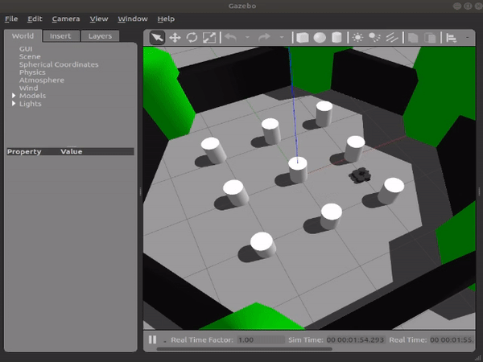

# A Naive Obstacle Avoidance Technique for Turtlebot 3 implemented in ROS
This is a part of my small effort in creating some basic projects implemented in ROS. As I am totally new at learning ROS, feel free to give constructive comments. If you are absolutely new at learning ROS, it might help you. You may use the codes as-is. 

## Introduction 
This is an obstacle avoidance technique simulated with Turtlebot 3 in Gazebo, ROS. The Turtlebot uses planar laser range-finder to detect obstacles in front as well as 15 degrees left and right from the front. Then based on the obstacle range, it either goes forward with linear velocity or, stops and rotates with angular velocity until it finds an obstacle-free path to go forward again.

## Pre-requisites
- Python 2 
- Gazebo (comes pre-installed with ros-desktop-full)
- [Turtlebot 3 simulation package](https://github.com/ROBOTIS-GIT/turtlebot3_simulations.git)

## Installation
```
cd ~/catkin_ws/src
git clone https://github.com/enansakib/obstacle-avoidance-turtlebot.git
cd ~/catkin_ws
catkin_make
```

## Usage
```
roslaunch turtlebot3_gazebo turtlebot3_world.launch
roslaunch obstacle-avoidance-turtlebot naive_obs_avoid.launch
```

## Demo



## Details
The code inside the `src` folder already has necessary comments to understand what's going on. 
We define a `obstacle_avoidance_node` which subscribes to `/scan` topic and reads `LaserScan` type messages (because we want to detect obstacles). And it publishes `Twist` type message to `/cmd_vel` topic (because we want to move the robot). 


If you do `rosmsg show LaserScan` and `rosmsg show Twist`, you would see the message formats.
- we are interested in the `float32[] ranges` from the `LaserScan` message which is nothing but a `list` of 359 obstacle distances from the robot (0 degree to 359 degree).
And,
- we are interested in both `linear` and `angular` 3D vectors' x and z values, respectively (to move forward and rotate) from the `Twist` message.

### Note
This is implemented on Ubuntu 18.04, ROS Melodic Morenia.

## Reference
1. http://wiki.ros.org/ROS/Tutorials
2. https://github.com/ROBOTIS-GIT/turtlebot3_simulations.git
3. http://gazebosim.org/tutorials?tut=ros_overview
